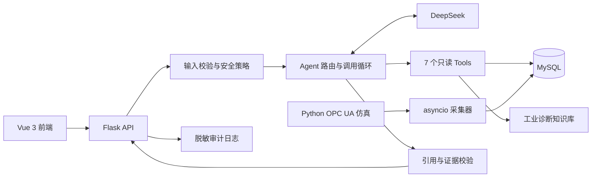

# 工业设备智能诊断 Agent

基于 Python OPC UA、MySQL、Flask、Vue 3 和 DeepSeek 构建的工业时序数据诊断 Agent。系统将设备指标、状态事件、故障记录、遥测摘要和产线分析封装为受控的只读 Tools，并结合独立工业知识库生成带证据引用和数据限制的诊断结论。

当前版本面向工业设备运行分析与异常诊断场景。系统连接 Python OPC UA 仿真环境；知识库采用项目自建 runbook，不包含设备厂商维修手册。

## 项目亮点

- **完整数据闭环**：3 条仿真产线、9 台设备，以约 1 秒周期完成 OPC UA 采集、状态事件化、MySQL 持久化和 KPI 计算。
- **7 个只读 Tools**：覆盖设备 KPI、状态、故障、遥测摘要、产线时间线、产线 KPI 和知识检索。
- **受控 Agent 编排**：高置信问题采用确定性路由和工具预执行，复杂问题使用 DeepSeek Tool Calling；模型不能调用当前路由未开放的工具。
- **可追溯回答**：校验知识库引用、`status_event_log:<id>` 和 `raw_telemetry:<id>`，缺少或伪造引用时将回答降级为 `needs_review`。
- **独立 RAG**：6 份版本化诊断文档、27 个章节块，支持内容哈希、知识库 revision 和文件变更自动重载。
- **安全与可靠性**：固定查询、参数白名单、工具/轮次预算、并发限制、有限重试、CORS 白名单、可选 Bearer Token 和脱敏轮转审计日志。
- **可复现评测**：44 项后端测试、14 条离线检索案例和 8 条真实模型回归案例。

## 评测基线

| 指标 | 当前结果 | 说明 |
| --- | ---: | --- |
| 后端测试 | 44/44 | 单元测试及隔离 MySQL 集成测试 |
| DeepSeek 真实回归 | 8/8 | 小型版本化回归集，不代表生产准确率 100% |
| RAG Hit@1 | 0.9231 | 相关查询首条命中率 |
| RAG Hit@3 | 1.0000 | 相关查询前三条命中率 |
| RAG MRR | 0.9615 | 首个正确结果的平均倒数排名 |
| 无关问题拒绝率 | 1.0000 | 当前基准含 1 条无关查询 |
| 真实回归平均消耗 | 约 2,098 tokens | 8 条案例共 16,781 tokens |
| 真实回归平均耗时 | 约 4.02 秒/例 | 单次串行基线，不是并发 P95 |

## 系统架构



## Agent Tools

| Tool | 用途 |
| --- | --- |
| `query_kpi` | 查询设备日 KPI、数据质量和可选日期对比 |
| `query_device_state` | 查询设备状态事件、跨日裁剪和分页证据 |
| `query_fault_events` | 查询故障事件和项目模拟故障字典 |
| `query_telemetry_summary` | 汇总转速、负载、温度、计数器和采集连续性 |
| `query_line_timeline` | 对齐一条产线 CNC、Robot、PLC 的状态时间线 |
| `query_line_kpi` | 查询产线 KPI、三工位贡献和数据限制 |
| `search_knowledge` | 检索 OEE、CNC、Robot、PLC/OPC UA 和数据质量知识 |

所有数据 Tool 均使用固定 SQL/ORM 查询、严格 JSON Schema、设备或产线白名单和结果大小限制。系统不提供任意 SQL，也不执行 PLC 或设备写操作。

## 本地运行

### 环境要求

- Python 3.11 或更高版本
- MySQL 8.x
- Node.js 20.19+ 或 22.12+
- DeepSeek API Key

### 1. 安装后端依赖

```bash
python3 -m venv .venv
source .venv/bin/activate
python -m pip install -r backend/requirements.txt
```

### 2. 配置环境变量

```bash
cp backend/.env.example backend/.env
```

编辑 `backend/.env`，填写本机 MySQL 密码和 DeepSeek API Key。`.env` 已被 Git 忽略，请勿提交密钥。

### 3. 启动后端

```bash
.venv/bin/python backend/run_local.py
```

一键入口会启动 Python OPC UA Server、生产工况仿真、数据采集、隔离的 `industrial_agent_demo` MySQL 数据库和 Flask API。

健康检查：

```bash
curl http://127.0.0.1:5001/api/health
```

### 4. 启动前端

```bash
cd frontend
npm ci
npm run dev -- --host 127.0.0.1
```

打开 `http://127.0.0.1:5173`。

## 命令行使用

只检查模型配置，不发送请求：

```bash
.venv/bin/python backend/agent_cli.py --check
```

执行一次真实诊断：

```bash
.venv/bin/python backend/agent_cli.py \
  '查询 BJ-CNC-001 今天的 OEE，并结合停机事件说明异常和数据限制'
```

直接验证工具，不调用 LLM：

```bash
.venv/bin/python backend/tool_cli.py query_line_kpi --line-id 1 --date 2026-09-08
.venv/bin/python backend/tool_cli.py search_knowledge \
  --query 'CNC 的 OEE 下降时应该按什么顺序排查？'
```

## 测试与评测

后端测试：

```bash
.venv/bin/python -m unittest discover -s backend/tests -p 'test_*.py'
```

离线 RAG 检索评测，不消耗模型额度：

```bash
.venv/bin/python backend/evaluate_retrieval.py
```

真实模型回归，会消耗 DeepSeek 额度：

```bash
.venv/bin/python backend/evaluate_agent.py --summary-only
```

前端生产构建：

```bash
cd frontend
npm ci
npm run build
```

GitHub Actions 使用 MySQL 8.4、Python 3.12 和 Node.js 22 自动执行后端测试、离线检索评测、前端构建和敏感文件检查。真实模型评测不会在 CI 中消耗 API 额度。

## 关键接口

- `GET /api/health`：数据库、知识库、模型配置、Tools 和审计目录健康状态。
- `POST /api/agent/chat`：Agent 对话，接受 `question` 和可选 `conversation_id`。
- `GET /api/tools`：查看 provider-independent Tool Schema。
- `POST /api/tools/<name>`：直接调用指定只读 Tool。
- `GET /api/workshop/kpi`：车间、产线和工位 KPI。
- `GET /api/events`：状态事件、报警排行和损失分布。

## 项目结构

```text
.
├── backend/
│   ├── deepseek_agent.py       # Agent 编排、路由、Tool Calling、grounding
│   ├── agent_tools.py          # 7 个只读 Tools 与 JSON Schema
│   ├── knowledge_base.py       # 本地 RAG 加载、切块、检索与版本指纹
│   ├── knowledge/              # 6 份独立工业诊断 runbook
│   ├── evals/                  # Agent 与 RAG 评测案例
│   ├── opcua_server.py         # Python OPC UA 仿真服务
│   ├── cnc_logic.py            # 数据采集与状态事件化
│   ├── kpi_engine.py           # KPI 计算与数据质量处理
│   ├── app.py                  # Flask API
│   └── tests/                  # 后端与 MySQL 集成测试
├── frontend/                   # Vue 3 + Element Plus + ECharts
├── artifacts/                  # 脱敏联调结果示例
├── AGENT_ENGINEERING_REVIEW.md # 工程成熟度与生产化差距
├── AGENT_INTERVIEW_GUIDE.md    # 项目理解与面试指南
└── PRODUCT_REVIEW.md           # 产品视角审查
```

## 安全与使用边界

- 当前系统只读，不具备设备控制或维修执行能力。
- 模拟故障字典和项目知识库只能生成排查假设，不能确认真实物理根因。
- `AGENT_API_TOKEN` 是本地演示保护，不等同于企业 IdP、JWT、RBAC 或租户隔离。
- 生产化仍需数据库只读运行账号、Secrets Manager、Redis/任务队列、OpenTelemetry、厂商授权资料和更大规模评测。

更完整的设计取舍和限制见 [Agent 工程审查](AGENT_ENGINEERING_REVIEW.md)，面试讲解见 [Agent 面试指南](AGENT_INTERVIEW_GUIDE.md)。
